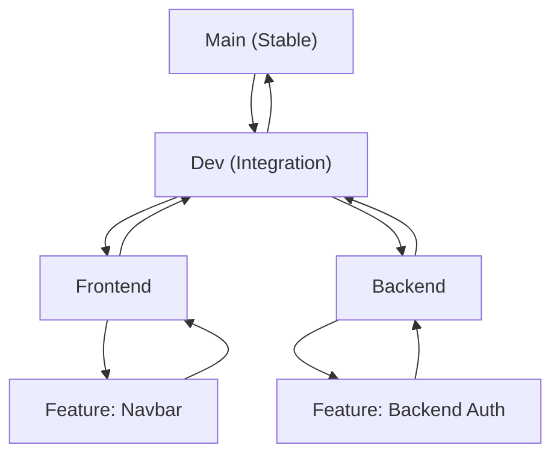

# 🔖 Branching Strategy 🌱 

## 🌟 Main Branches

### 1️⃣ `main` (Stable, Production-Ready Code)
- This branch contains **only stable and tested code**.
- Merges into `main` should come **only from `dev`** after thorough testing.
- No direct commits to `main` (only merge commits from `dev`).

### 2️⃣ `dev` (Integration & Testing)
- This is the **development branch** where all **feature branches** are merged.
- It serves as the staging environment for upcoming changes before release.
- Feature branches should be merged into `dev` via **pull requests (PRs)** after code reviews.

---

## 🚀 Feature Development Branches

### 3️⃣ `frontend` (Frontend Development)
- A long-lived branch where **all frontend changes** are merged.
- Developers working on the UI should create **feature branches off this branch**.
- Once stable, the frontend team merges it into `dev`.

### 4️⃣ `backend` (Backend Development)
- A long-lived branch where **backend API, database, and web scraping work happens**.
- All backend-related feature branches should be created off `backend`.
- Once stable, the backend team merges it into `dev`.

---

## 🛩 Feature Branches

- Feature branches are created **off their respective `frontend` or `backend` branches**.
- **Naming convention:**
  - `feature/frontend-navbar`
  - `feature/backend-auth`
  - `feature/backend-scraper`
- **Merging Process:**
  - Open a **Pull Request (PR) to merge into `frontend` or `backend`**.
  - After frontend/backend testing, merge into `dev`.

## 🛠 Bug Fixing

### 5️⃣ `bugfix/*`
- Used for fixing non-critical bugs.
- Created from `dev` and merged back into `dev`.
- Example: `bugfix/frontend-button-bug`

---

---



## 📌 Workflow Example

### 1️⃣ Start a New Feature
```bash
git checkout -b feature/frontend-navbar frontend
```
(Creates a feature branch off of the "frontend" branch)

### 2️⃣ Make Changes & Commit
```bash
git add .
git commit -m "Added responsive navbar component"
```

### 3️⃣ Push to Remote & Create PR
```bash
git push origin feature/frontend-navbar
```

### 4️⃣ Create a Pull Request
- PR from `feature/frontend-navbar` → `frontend`
- Review & approve
- Merge into `frontend`

### 5️⃣ Merge into Dev
- Once `frontend` is stable, merge it into `dev`
- Repeat for `backend` features

### 6️⃣ Release to `main`
- Once `dev` is fully tested, merge `dev` into `main`.

---

## 🚀 Keeping Your Local Version Up to Date

### 1️⃣ Add the Remote Repository
If you haven't added the repository as a remote yet, do so with:
```bash
git remote add origin https://github.com/UNLV-CS472-672/2025-S-GROUP3-RebelRemind.git
```

### 2️⃣ Fetch the Latest Changes from Remote
To keep your local copy up to date with the latest changes from the repository:
```bash
git checkout main
git pull origin main
```

### 3️⃣ Update Your Local `dev` Branch
```bash
git checkout dev
git pull origin dev
```

### 4️⃣ Keep Your Feature Branch Updated While Working
If you’re working on a feature branch and need to update it with the latest changes:
```bash
git checkout feature/frontend-navbar
git fetch origin
git merge origin/dev
```
This will pull the current dev branch into the feature you are working on.

If you encounter merge conflicts, resolve them before committing.

### 5️⃣ Pull The Latest Version of Your Feature
```bash
git checkout feature/frontend-navbar
git fetch origin
git merge origin/feature/frontend-navbar
```
This is handy if there are multiple of us working on the same branch.

If you encounter merge conflicts, resolve them before committing.

### 6️⃣ Push the Updated Branch to Remote
```bash
git push origin feature/frontend-navbar
```

---

## 🚀 Summary of Rules
- ✅ No direct commits to `main` or `dev`.
- ✅ Feature branches merge into their respective team branch (`frontend` or `backend`).
- ✅ Once stable, `frontend` and `backend` merge into `dev`.
- ✅ `dev` merges into `main` after testing for a release.
- ✅ Use `bugfix/*` for issues
